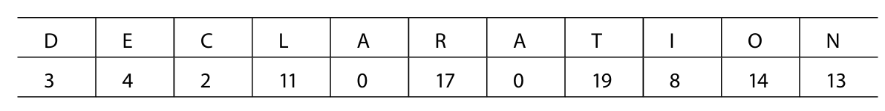
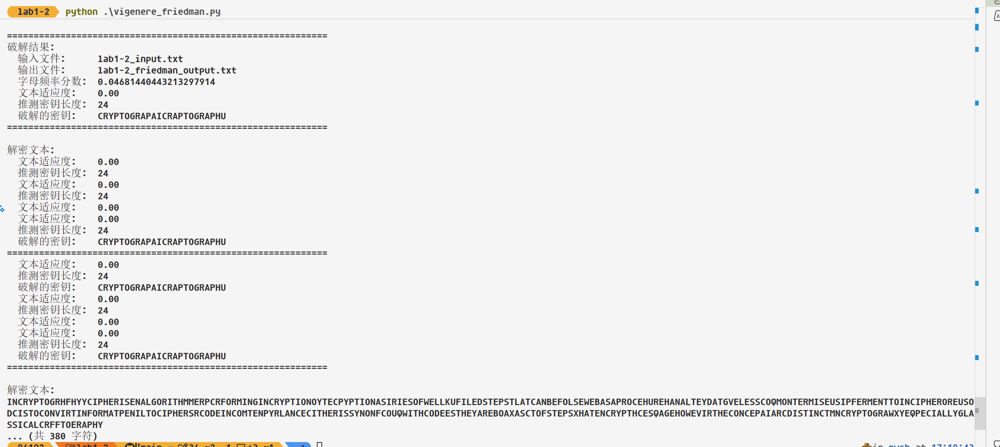
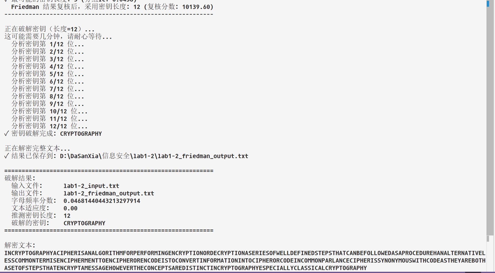
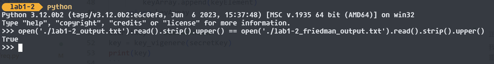

# 《信息安全》实验报告

| 项目 | 内容 |
|------|------|
| 实验名称 | Vigenere 密码的加密与解密 |
| 姓名 | 黄文峰 |
| 学号 | 23302010049 |
| 日期 | 2026/3/19 |

---

## 1 实验目的

- 了解古典密码中的加密和解密运算
- 了解古典密码体制
- 掌握古典密码的统计分析方法

## 2 实验原理

Vigenere 密码是一种多字母表替换密码。使用一个关键词循环重复构建与明文等长的密钥[^1]，然后逐字母进行移位加密：

- 加密：C ≡ M + K (mod 26)
- 解密：M ≡ C − K (mod 26)

> **TODO**: 根据自己的理解，补充 Vigenere 密码的原理细节（如字母表对照、密钥构建过程等）。

Vigenere加密实际上就是单表替换凯撒加密的进阶， 因为秘钥长度往往比较短，实际上的效果就是每隔len(key)个字母的密文字母使用的是同一个替换表，也就是这些字母的移位量是相同的。

凯撒加密的秘钥是一个1~25[^2]的数字(0认为是没有加密)，而Vigenere加密的秘钥则是一串字母序列，等价于一串数字（移位量）且每个数字介于0~25（将字母和数字依次映射， A->0, B->1，以此类推）.

[^2]: 我们默认使用大写字母， 并且不考虑空格等其他字符

### 2.1 从秘钥字符串得到秘钥数字串

假设秘钥是: 'DECLARATION'

那么对应的移位量序列如下：



对应的转化算法如下python函数所示，可以得到一串数字，方便后续处理。

```python
def key_vigenere(key):
    keyArray = []
    for i in range(0,len(key)):
        keyElement = ord(key[i]) - 65 #A的ascii值为65
        keyArray.append(keyElement)
    return keyArray

secretKey = 'DECLARATION'
key = key_vigenere(secretKey)
print(key)
```

### 2.2 利用秘钥数字序列进行循环移位加密

[^1]: 文档最开始说的想法也有道理，可以先把秘钥序列循环到刚好不小于密文的长度，然后尾截断到和密文一样长得到等长秘钥，之后可以直接加密。这和循环遍历秘钥序列是一样的效果，下面我实现后者(因为python有itertools下的cycle接口产生无限循环的迭代器，可以直接用这个)。

```python
from itertools import cycle
def shiftEnc(c, offset):#根据位移量，向后位移offset得到新字母
    return chr((ord(c) - ord('A') + offset) % 26 + ord('A'))

def enc_vigenere(plaintext, key):
    secret = ''.join(shiftEnc(p, k) for p, k in zip(plaintext, cycle(key)))
    return secret

secretKey = 'DECLARATION'
key = key_vigenere(secretKey)
plaintext = 'WEAREFAMILY'
ciphertext = enc_vigenere(plaintext, key)
print(ciphertext)
```

### 2.3 理解“字母表对照”

理解这个算法的关键就在于循环加密的理解，有一个周期性（周期为len(key)）。

介绍Vigenere加密的时候往往会给出一个很大的字母表格，这个表格实际上就是循环加密的一种具象化，如下图(在线网站[Vigenere Cipher Table - Tabula Recta Tool](https://caesarcipher.org/ciphers/vigenere/table)提供了这个表格，在这里我表示衷心感谢)。

我将'ILOVEYOU'用秘钥'LOVE'加密。对表格的解释如下：


首先把每一行开头的字母看做明文中出现的字母，每一列开头的字母看做对应的秘钥字母（循环迭代对应或者循环拼接成等长秘钥后，秘钥当中的字母按位次和明文字母一一对应）。

我们把秘钥循环并截短到等长秘钥: LOVELOVE(明文有8个字母)

那么明文和秘钥字母的对应加密关系为（下图的加法省略了转成从0到25的整数和对26取模的部分）:


体现在表格当中就是，我们想知道I被L加密成为什么了的时候，找到行首为I的行和列首位L的列，他们的交点（共同元素）就是密文字母——也就是表格中高亮成绿色的字母T。其他字母以此类推，当前4个字母ILOV被推理玩的时候，发现LOVE也正好迭代完了一次，于是开始循环迭代，EYOU对应第二次迭代的LOVE。

另一种角度是，将每一列看作是一张单表，秘钥有多个字母，因此Vigenere cipher也被称之为多字母表替换(polyalphabetic cipher)

具体的加/解密代码实现在后文部分给出。

## 3 实验环境

- 操作系统：Windows 11
- 编程语言：Python3.12

## 4 实验内容

1. 给定密钥，实现 Vigenere 密码的加密和解密算法
   - 加密测试：明文 `THEBASICOFCRYPTOGRAPHY`，密钥 `SECURITY` → 密文 `LLGVRABAGJELPXMMYVCJYG`
   - 解密测试：密文 `YBHBNXCFOSHLBPGTAUACMS`，密钥 `FUDAN` → 明文 `THEBASICOFCRYPTOGRAPHY`
2. 使用密钥 `CRYPTOGRAPHY` 解密 `lab1-2_input.txt`，将结果保存为 `lab1-2_output.txt`
3. 将解密结果中包含的信息写入实验报告
4. 完成实验报告

## 5 实验思路

> 结合代码说明算法设计思想与实现步骤。

### 5.1 加密算法实现

这部分的原理在第2部分已经说过，选择python作为实现语言是因为python支持多种编程模式，而且生态丰富，学界常用这门语言，另外他的迭代器也很丰富，写法比较简洁明了。

这里给出python代码：

```python
def shiftEnc(c, offset):#根据位移量，向后位移offset得到新字母
    return chr((ord(c) - ord('A') + offset) % 26 + ord('A'))

def enc_vigenere(plaintext, key):
    secret = ''.join(shiftEnc(p, k) for p, k in zip(plaintext, cycle(key)))
    return secret
```

主要用到了chr()和ord()来实现ascii码和字符的转化，进一步实现数字计算。

同时python的迭代特性也使得代码比较简洁。

### 5.2 解密算法实现

```python
def shiftDec(c, offset):#根据位移量，向前位移offset得到原字母
    return chr((ord(c) - ord('A') + 26 - offset) % 26 + ord('A')) #加26是为了避免负数取余，尽管这里如果c是大写字母的话不可能出现这种情况

def dec_vigenere(ciphertext, key):
    plain = ''.join(shiftDec(c, k) for c, k in zip(ciphertext, cycle(key)))
    return plain

```

基本上是和加密算法对称的写法，只是位移要还原回去的话是反向位移，也就是减去秘钥字母并取余。 其余写法和加密算法大差不差。

调用这些算法进行操作的部分写在main函数中,为了方便没有写成接受命令行参数的可拓展模式，而是**硬编码**了要求中的测试用例，如下：

```python
def main():
    # 加密测试
    plaintext_test = "THEBASICOFCRYPTOGRAPHY"
    key_encrypt = "SECURITY"
    expected_ciphertext = "LLGVRABAGJELPXMMYVCJYG"
    encrypted = enc_vigenere(plaintext_test, key_vigenere(key_encrypt))
    print("加密测试结果:", encrypted)
    print("加密测试是否通过:", encrypted == expected_ciphertext)

    # 解密测试
    ciphertext_test = "YBHBNXCFOSHLBPGTAUACMS"
    key_decrypt = "FUDAN"
    expected_plaintext = "THEBASICOFCRYPTOGRAPHY"
    decrypted = dec_vigenere(ciphertext_test, key_vigenere(key_decrypt))
    print("解密测试结果:", decrypted)
    print("解密测试是否通过:", decrypted == expected_plaintext)

    # 文件解密：只处理字母字符，避免换行或空格影响计算
    input_path = os.path.join(os.path.dirname(__file__), "lab1-2_input.txt")
    output_path = os.path.join(os.path.dirname(__file__), "lab1-2_output.txt")
    file_key = key_vigenere("CRYPTOGRAPHY")

    with open(input_path, "r", encoding="utf-8") as file:
        ciphertext = file.read()

    ciphertext = ''.join(c for c in ciphertext.upper() if 'A' <= c <= 'Z')
    plaintext = dec_vigenere(ciphertext, file_key)

    with open(output_path, "w", encoding="utf-8") as file:
        file.write(plaintext)

    print("文件解密完成，结果已保存到:", output_path)
```

## 6 实验结果

> 通过复制或截图的方式记录实验执行的结果。


这是具体的lab1-2_output.txt内容：

> INCRYPTOGRAPHYACIPHERISANALGORITHMFORPERFORMINGENCRYPTIONORDECRYPTIONASERIESOFWELLDEFINEDSTEPSTHATCANBEFOLLOWEDASAPROCEDUREHANALTERNATIVELESSCOMMONTERMISENCIPHERMENTTOENCIPHERORENCODEISTOCONVERTINFORMATIONINTOCIPHERORCODEINCOMMONPARLANCECIPHERISSYNONYMOUSWITHCODEASTHEYAREBOTHASETOFSTEPSTHATENCRYPTAMESSAGEHOWEVERTHECONCEPTSAREDISTINCTINCRYPTOGRAPHYESPECIALLYCLASSICALCRYPTOGRAPHY

由于去掉了空格，可读性不是很高，不过还是很明显可以看出来这段话主要在讲关于密码学的事情。

## 7 扩展实验（选做，不计分）

> 破解 Vigenere 密码：利用 Kasiski 测试或 Friedman 测试推断密钥长度，再通过字母频率分析推断密钥。

### 7.1 破解原理Friedman测试

英文文本中有个特性就是26个字母出现的频率平方和大约在0.065左右。而随机的乱文本，比如vigenere加密后的文本的频率平方和约0.04左右。

利用这个性质，我们可以知道自己面对的一段文本是不是有意义的明文。而另一方面，注意到，普通的单表替换得到的密文并不会让这个性质消失掉，得到的密文的字母频率平方和仍然大约在0.065左右，前文已经说过，**vigenere密码表的原理就是相隔一定长度的字母使用的是同一个字母表替换**，替换之后不会丧失频率平方和的属性，将这些字母集合在一起，算他们相对的频率平方和应当是0.065左右。

我们可以枚举秘钥长度，直到算出来的那些推测使用同一张字母表替换的字母的频率平方和是0.065左右就说明猜到了密钥长度。

python当中的切片操作很适合我们在枚举秘钥长度的时候找出使用同一张字母表替换的那些字母。

另一方面，得到密钥长度之后，回想一下凯撒密码之类的单表替换密码是怎么破解的？使用频率分析，知道每个字母的出现频率高低是有区别的，我们一一对应即可。

到了这里，我们可以很清晰的知道Friedman测试的流程分为两步。

1. 根据英文文本和乱码文本的字母频率平方和不同以及vigenere密码是个多表替换算法的事实，枚举得到密钥长度。
2. 根据密钥长度，得到多个由不同字母表加密的字母集合，对每个字母集合来说他们都是单表替换加密的，使用频率分析法就能够得出明文字母和密文字母的配对关系。

### 7.2 其他前置条件

一般而言，使用频率来破解密码，样本数量，在这里是密文长度是要足够大的，我们假定本次lab提供的数据是够用的。

> 这里我使用参考教材中提供的github链接来得到这些资源，参考教材为：**Implementing Cryptography Using Python (Shannon Bray)**

### 7.3 源码关键实现

首先对密文等进行清洗，得到只有大写字母的干净密文。

```python
def getTextOnly(text):
    """清理文本：去除空格、转小写、保留纯字母"""
    if isinstance(text, bytes):
        text = text.decode('utf-8', errors='ignore')
    
    modifiedText = str(text.strip())
    modifiedText = modifiedText.replace(" ", "")
    modifiedText = " ".join(modifiedText.split())
    modifiedText = modifiedText.lower()
    # 只保留字母
    modifiedText = ''.join(filter(str.isalpha, modifiedText))
    return modifiedText
```

其次计算字母频率和

```	python
def getLetterFreqs(text):
    """计算字母频率的平方和（用于检测是否为自然语言）"""
    frequency = {}
    text_length = len(text)
    if text_length == 0:
        return 0.0
    
    for ascii_code in range(ord('a'), ord('a') + 26):
        char = chr(ascii_code)
        frequency[char] = float(text.count(char)) / text_length
    
    sum_freqs_squared = 0.0
    for ltr in frequency:
        sum_freqs_squared += frequency[ltr] * frequency[ltr]
    return sum_freqs_squared

```


阶段二需要的字母频率表：

```python
NORMAL_FREQS = {
    'a': 0.080642499002080981, 'b': 0.015373768624831691, 'c': 0.026892340312538593,
    'd': 0.043286671390026357, 'e': 0.12886234260657689, 'f': 0.024484713711692099,
    'g': 0.019625534749730816, 'h': 0.060987267963718068, 'i': 0.06905550211598431,
    'j': 0.0011176940633901926, 'k': 0.0062521823678781188, 'l': 0.041016761327711163,
    'm': 0.025009719347800208, 'n': 0.069849754102356679, 'o': 0.073783151266212627,
    'p': 0.017031440203182008, 'q': 0.0010648594165322703, 'r': 0.06156572691936394,
    's': 0.063817324270355996, 't': 0.090246649949305979, 'u': 0.027856851020401599,
    'v': 0.010257964235274787, 'w': 0.021192261444145363, 'x': 0.0016941732664605912,
    'y': 0.01806326249861108, 'z': 0.0009695838238376564
}
```

阶段二需要的打分函数（根据字典记载的常用词）:

```python
def getFitnessScore(message, longerwords):
    """计算文本适应度分数（基于常用词匹配）"""
    score = 0.0
    message = message.lower()
    for word in longerwords:
        wordWeight = message.count(word)
        if wordWeight > 0:
            score += wordWeight * 50 * len(word)
    return score

```

阶段二枚举密钥长度：

```python
def getKeyLength(encryptedText):
    """使用重合指数法猜测密钥长度"""
    highest = 0
    highCtr = 0
    encryptedText = encryptedText.lower()
    
    print("正在分析密钥长度...")
    for key_len in range(1, 26):
        # 按密钥长度采样：取每第key_len个字符
        sampling = encryptedText[::key_len]
        freqCheck = getLetterFreqs(sampling)
        
        if highest < freqCheck:
            highest = freqCheck
            highCtr = key_len
    
    print(f"✓ 最可能的密钥长度: {highCtr} (频率分数: {highest:.4f})")
    return highCtr
```

### 7.4 实验结果与改进后的结果

很遗憾，可能是由于样本太小，我们推测的秘钥长度错了，可以看见破解的秘钥前半部分和后半部分都很像正确答案。然而还是有不小的偏差。另一个可能是单词表不够专题化，没有密码学相关单词，不过这应该不是主要原因。



思考如何改进？

### 7.4.1 改进思路

我最后采用的是“二阶段”方法：

1. 先用 Friedman 公式估计一个密钥长度初值（理论依据）。
2. 再用解密结果质量复核长度（实践依据）。

这样就不会只依赖单一统计量，能明显减少误判。

### 7.4.2 核心改进代码

1) 标准 IC + Friedman 公式（先给长度初值）

```python
KAPPA_P = 0.0655
KAPPA_R = 1 / 26

def getIC(text):
    text = text.lower()
    N = len(text)
    if N < 2:
        return 0.0
    counts = {ch: text.count(ch) for ch in ALPHA_LOWER}
    numerator = sum(counts[ch] * (counts[ch] - 1) for ch in ALPHA_LOWER)
    return numerator / (N * (N - 1))

def estimateFriedmanKeyLength(text):
    N = len(text)
    if N < 2:
        return 1.0, 0.0
    ic = getIC(text)
    denominator = ((N - 1) * ic) - (KAPPA_R * N) + KAPPA_P
    if denominator <= 0:
        return 1.0, ic
    L = (0.027 * N) / denominator
    return max(1.0, L), ic
```

2) 长度复核（让“解密质量”参与决策）

```python
def refineKeyLength(encryptedText, dictionary, initial_len):
    best_len = initial_len
    best_score = float("-inf")
    for key_len in range(1, 26):
        key_guess = getKey(encryptedText, key_len, dictionary, verbose=False)
        decrypted = decryptIndex([ord(c) - 65 for c in key_guess], encryptedText)
        fitness = getFitnessScore(decrypted, dictionary)
        plain_ic = getIC(decrypted.lower())
        score = fitness + (3000 * plain_ic) - (5 * key_len)
        if score > best_score:
            best_score = score
            best_len = key_len
    return best_len, best_score
```

3) 每列 Caesar 破译改用卡方检验（比固定阈值更稳）

```python
def findKeyPos(message, keyLength, keyPos):
    sampling = message.lower()[keyPos::keyLength]
    if len(sampling) == 0:
        return 0
    best_shift = 0
    best_score = float("inf")
    for possible_key in range(26):
        score = getCaesarChiSquareScore(sampling, possible_key)
        if score < best_score:
            best_score = score
            best_shift = possible_key
    return best_shift
```

### 7.4.3 改进后结果



为了交叉验证，我对比了直接用Vigenere解密算法，也就是对称模型的方法解密出来的结果，发现两者是完全一样的。

如下图，使用python快速比对两个文件内容相同。




## 8 实验总结

> 选填。可以记录调试过程中出现的问题及解决方法、对实验结果的分析、对实验的改进意见等。

主要是拓展部分不知是否是因为密文不够长，导致我的初始Friedman实现失败了，经过一些改进和校验，最终成功的识别出了正确的密钥。我的一个建议是之后可以提供更长的密文序列，这样统计频率可能更有把握，当然也不排除是我的算法的问题。

---

## 自查清单

提交前请逐项确认，完成的项目在「完成情况」列填写 **done**。

| # | 检查项 | 完成情况 |
|---|--------|----------|
| 1 | Vigenere 加密算法已实现 | done |
| 2 | Vigenere 解密算法已实现 | done |
| 3 | 加密测试用例通过（THEBASICOFCRYPTOGRAPHY + SECURITY → LLGVRABAGJELPXMMYVCJYG） | done |
| 4 | 解密测试用例通过（YBHBNXCFOSHLBPGTAUACMS + FUDAN → THEBASICOFCRYPTOGRAPHY） | done |
| 5 | 源代码可编译/运行 | done(python解释型) |
| 6 | `lab1-2_input.txt` 已解密并保存为 `lab1-2_output.txt` | done(使用Vigenere解密算法) |
| 7 | 解密结果中的信息已写入报告（第 6 节） | done |
| 8 | 实验思路阐述清晰（第 5 节） | done |
| 9 | 扩展实验（选做，不计分，第 7 节） | done |
| 10 | 提交文件结构正确（见实验指导书） | done |
