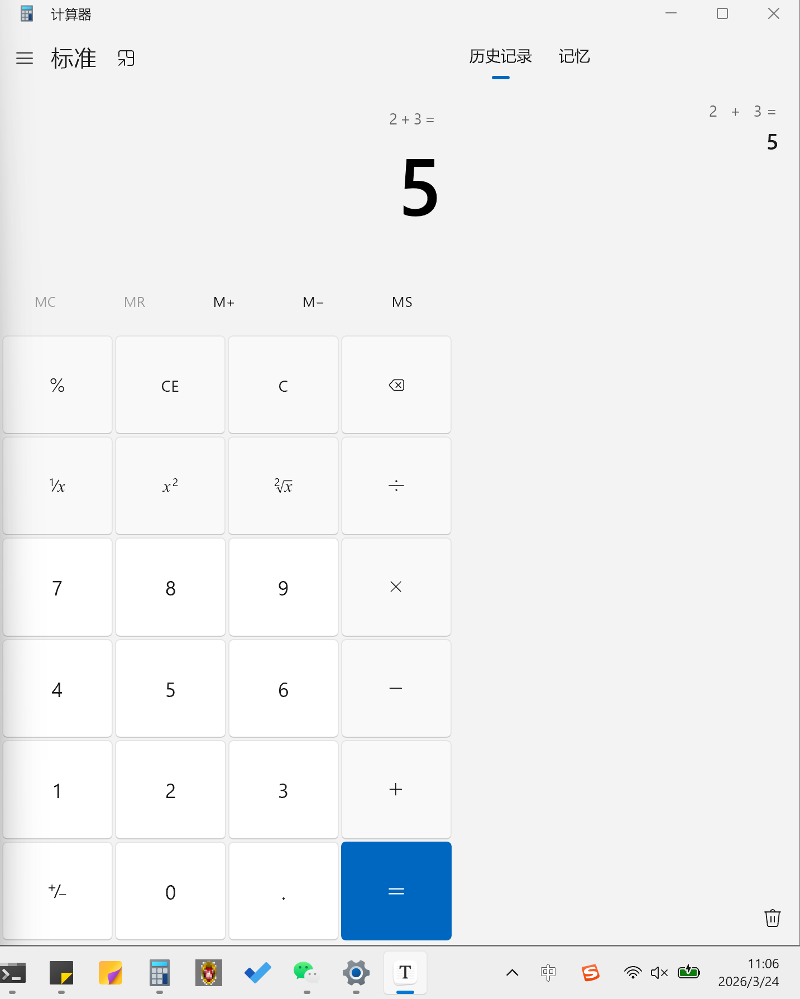
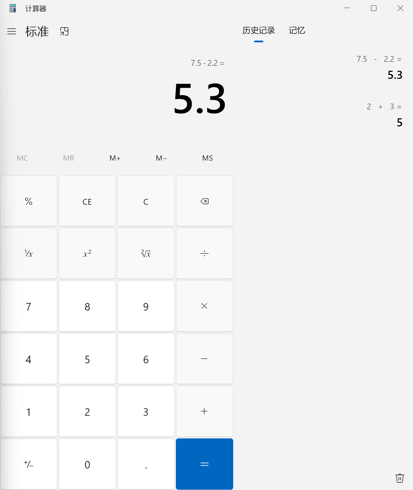
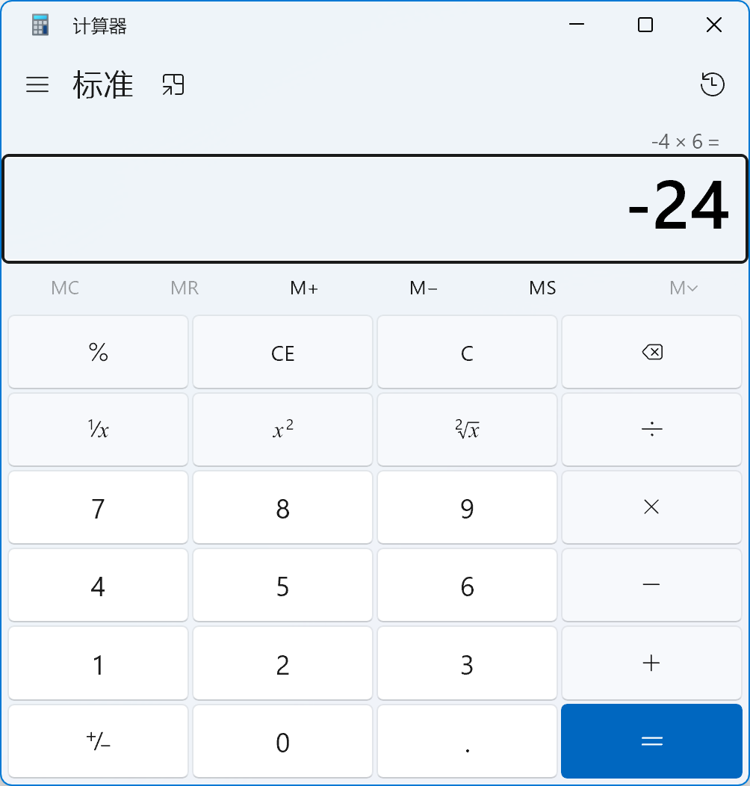
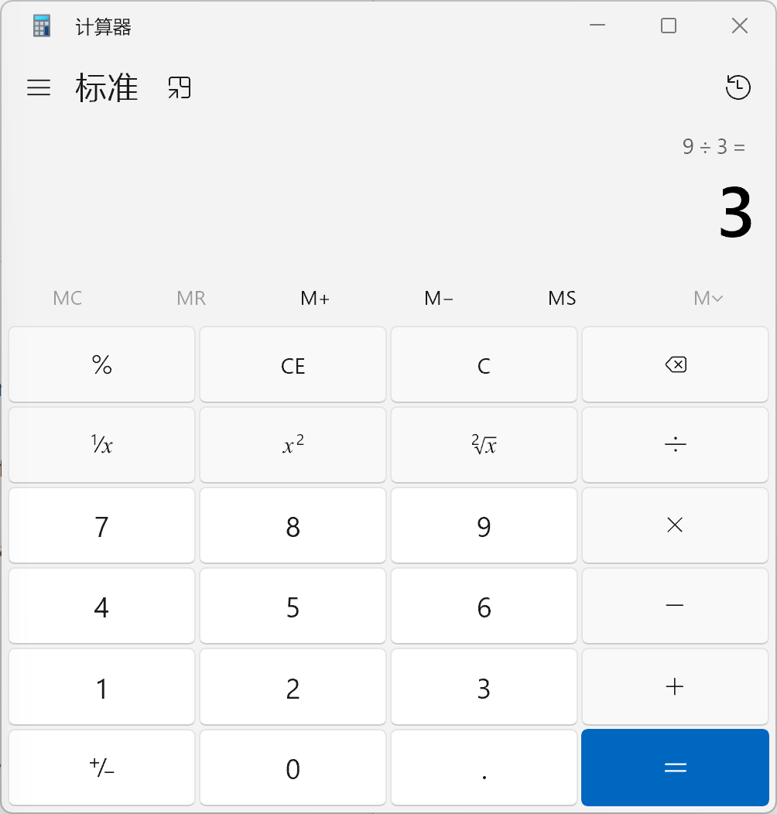
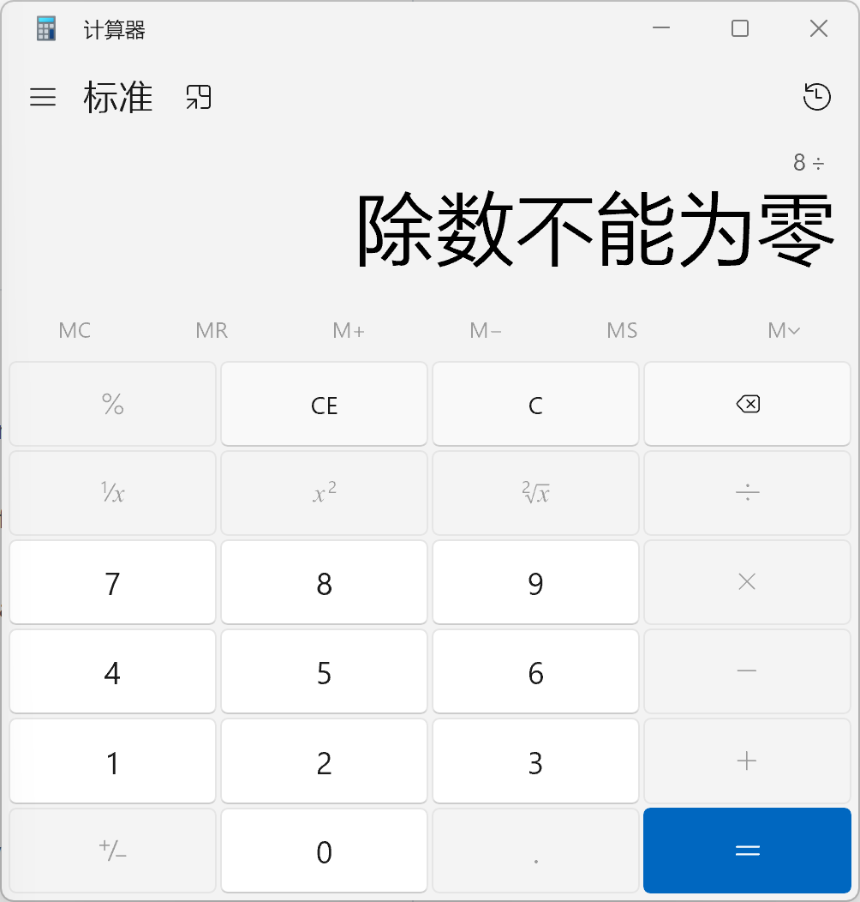
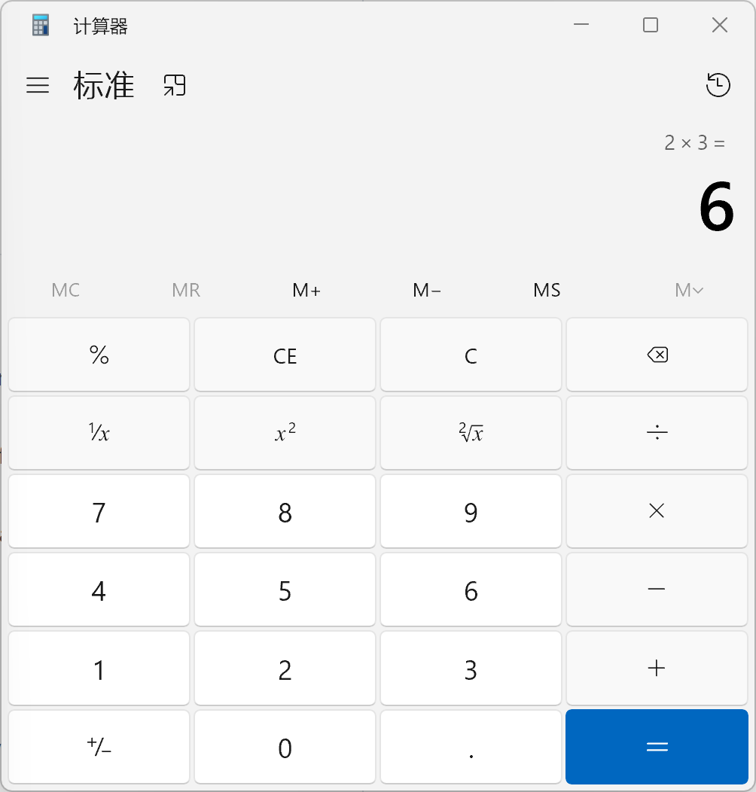
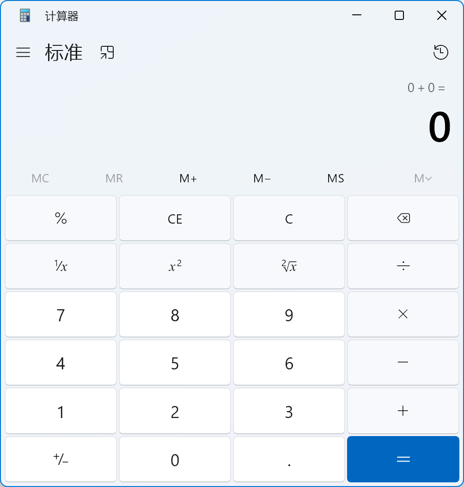
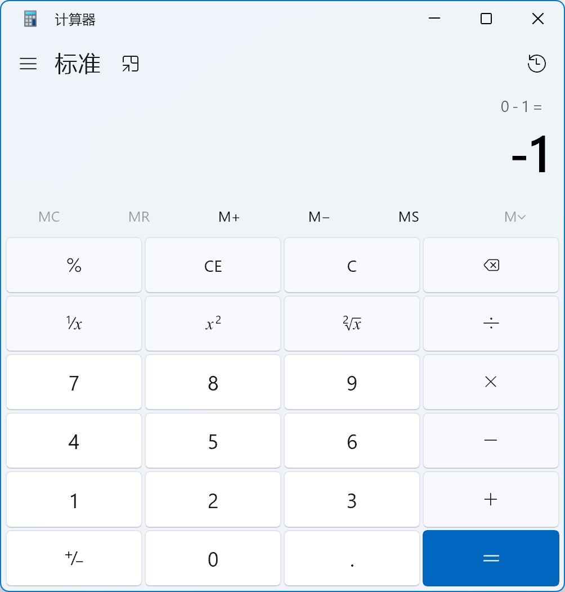
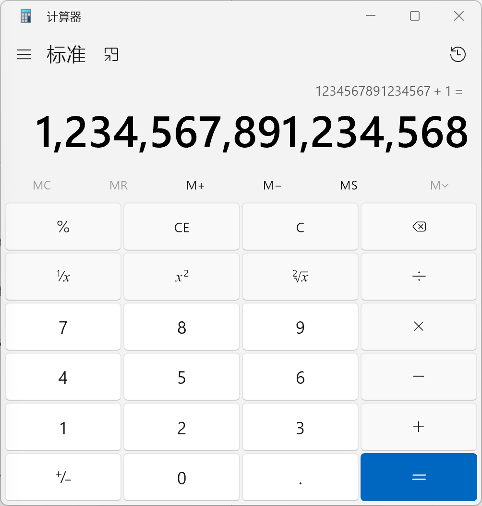

# Windows 11 计算器黑盒测试报告（Lab1）

## 1. 测试问题与范围

- 学号：23302010049
- 姓名：黄文峰
- 测试对象：Windows 11 系统计算器（标准模式）
- 测试范围：**标准模式四则运算**（加、减、乘、除）
- 测试目标：验证**标准模式下四则运算**的正确性与健壮性（指的是如果应对非法行为会给出合理的提示或报错）。
- 范围说明：为了**简单可控和篇幅限制**，本次不覆盖科学模式、程序员模式、日期计算、单位换算、汇率换算（根据github仓库的features说明，汇率换算是和Bing搜索引擎联动的，和网络有关，测试相对复杂）等功能。

## 2. 测试环境

- 操作系统：Windows 11 家庭中文版
- 版本号：25H2
- OS Build：26200.8037
- 计算器版本：11.2508.4.0
- 执行方式：手工黑盒测试

## 3. 规格依据（Black-box Specification）

本次黑盒测试不参考源码内部实现，仅依据用户可见功能与公开说明进行设计。因为没有找到详细的用户手册和Specification,只能参考github仓库的README中提到的几个features以及我们自己的算数运算经验，请助教见谅。

- 规格来源 1：Microsoft Calculator([microsoft/calculator: Windows Calculator: A simple yet powerful calculator that ships with Windows](https://github.com/Microsoft/calculator)) README 的公开特性说明
	- Standard Calculator functionality which offers basic operations and evaluates commands immediately as they are entered.
	- Infinite precision for basic arithmetic operations (addition, subtraction, multiplication, division) so that calculations never lose precision.
- 规格来源 2：基础数学规则（实际上这似乎并不是黑盒测试的定义，反而像是基于经验的测试）
	- 四则运算结果应符合常规数学定义。
	- 除数为 0 时应给出错误提示，不应崩溃或给出伪结果。

## 4. 黑盒测试方法

### 4.1 等价类划分

将输入划分为：

- 有效等价类：正常整数/小数/负数输入，且运算有定义。
- 无效等价类：非法按键序列、除以 0 等异常输入。

### 4.2 边界值分析

关注边界与临界场景：

- 0 值边界（如 0 参与运算）
- 符号边界（正负切换）
- 超长数字输入边界（接近显示长度上限）

### 4.3 决策表法

 “条件-动作”组合，验证不同输入条件下系统响应是否一致。

- 条件：除数是否为 0
- 动作：正常出结果 / 给出除零错误提示

决策表如下：

| 规则ID | 条件：除数=0？ | 动作A：显示正常商值 | 动作B：显示除零错误提示 | 对应用例 |
|---|---|---|---|---|
| R1 | 否 | 是 | 否 | TC-04（9 ÷ 3） |
| R2 | 是 | 否 | 是 | TC-05（8 ÷ 0） |

因此，TC-04 与 TC-05 共同覆盖了该决策表的两条核心规则。

## 5. 测试用例设计（10 条）

| 用例ID | 方法 | 测试点 | 输入步骤 | 预期结果 |
|---|---|---|---|---|
| TC-01 | 等价类（有效） | 整数加法 | 输入 `2 + 3 =` | 显示 `5` |
| TC-02 | 等价类（有效） | 小数减法 | 输入 `7.5 - 2.2 =` | 显示 `5.3` |
| TC-03 | 等价类（有效） | 负数乘法 | 输入 `-4 × 6 =` | 显示 `-24` |
| TC-04 | 等价类（有效） | 可整除除法 | 输入 `9 ÷ 3 =` | 显示 `3` |
| TC-05 | 等价类（无效） | 除零处理 | 输入 `8 ÷ 0 =` | 出现除零错误提示；程序不崩溃 |
| TC-06 | 等价类（无效） | 非法序列容错 | 输入 `2 + × 3 =` | 系统应有可预期处理（忽略/替换/提示），不应出现明显错误结果 |
| TC-07 | 边界值 | 0 值边界 | 输入 `0 + 0 =` | 显示 `0` |
| TC-08 | 边界值 | 符号边界 | 输入 `0 - 1 =` | 显示 `-1` |
| TC-09 | 边界值 | 单位边界 | 输入 `1 ÷ 1 =` | 显示 `1` |
| TC-10 | 边界值 + 决策表 | 超长输入稳定性 | 连续输入 25 位以上数字后执行 `+ 1 =` | 程序稳定；结果显示符合应用显示规则，不崩溃、不乱码 |

## 6. 执行结果记录

结论字段仅使用：通过 / 缺陷（非预期行为）。

| 用例ID | 实际结果 | 结论（通过/缺陷） | 证据截图编号 | 备注 |
|---|---|---|---|---|
| TC-01 | 显示5 | 通过 | [S01](#s01) |  |
| TC-02 | 显示5.3                                                      | 通过 | [S02](#s02) |  |
| TC-03 | 显示-24 | 通过 | [S03](#s03) | 计算器默认有个0开头，所以我们输入的-4实际上是通过0-4得到的。不过这并不影响后续的-4*6的正确性。 |
| TC-04 | 显示3 | 通过 | [S04](#s04) |  |
| TC-05 | 显示“除数不能为零” | 通过 | [S05](#s05) |  |
| TC-06 | 结果显示6，后输入的$\times$替换了之前的+,也就是算式从$2+\times3$变成了$2\times3$ | 通过 | [S06](#s06) | 没有崩溃，而是采用了替换的策略，算是一种健壮性，所以视为通过。 |
| TC-07 | 显示0 | 通过 | [S07](#s07) |  |
| TC-08 | 显示-1 | 通过 | [S08](#s08) |  |
| TC-09 | 显示1 | 通过 | [S09](#s09) |  |
| TC-10 | 标准模式计算器限制了输入数字长度为16，后续数字被抛弃。此16位数能进行+1计算,并得到正确结果。 | 通过 | [S10](#s10) | 采用了限制输入数字长度策略，也算是一种健壮性，所以视为通过。（值得注意的是，我在另一台Ubuntu24LTS系统的calculator上发现它的标准模式能输入的数字相当长，如果输入很长（将近100位）的数字后按下等号，会给出一个科学技术法表示的数字） |

## 7. 缺陷记录

- 在本次黑盒测试目标下未发现缺陷

## 8. 总结

- 本次共执行用例：10 条
- 通过：10 条
- 缺陷：0 条
- 结论：标准模式四则运算在本次样本下满足预期的正确性和健壮性，对异常和边界有良好的处理手段，健壮性高。

---

## 9. 截图快速跳转

[S01](#s01) | [S02](#s02) | [S03](#s03) | [S04](#s04) | [S05](#s05) | [S06](#s06) | [S07](#s07) | [S08](#s08) | [S09](#s09) | [S10](#s10)

### S01
（TC-01）

[返回顶部](#1-测试问题与范围)

### S02
（TC-02）

[返回顶部](#1-测试问题与范围)

### S03
（TC-03）

[返回顶部](#1-测试问题与范围)

### S04
（TC-04）

[返回顶部](#1-测试问题与范围)

### S05
（TC-05）

[返回顶部](#1-测试问题与范围)

### S06
（TC-06）

[返回顶部](#1-测试问题与范围)

### S07
（TC-07）

[返回顶部](#1-测试问题与范围)

### S08
（TC-08）

[返回顶部](#1-测试问题与范围)

### S09
（TC-09）

[返回顶部](#1-测试问题与范围)

### S10
（TC-10）

[返回顶部](#1-测试问题与范围)
