# 《信息安全》实验报告

| 项目 | 内容 |
|------|------|
| 实验名称 | Playfair 密码破译 |
| 姓名 | 黄文峰 |
| 学号 | 23302010049 |
| 日期 | 2026/3/11 |

---

## 1 实验目的

- 了解古典密码中的加密和解密运算
- 了解古典密码体制
- 掌握古典密码的破译方法

## 2 实验原理

Playfair 密码是一种基于 5×5 字母矩阵的双字母替换密码。使用密钥构建矩阵后，将明文按两个字母一组进行加密，加密规则取决于字母对在矩阵中的位置关系（同行、同列或矩形）。

本实验使用**模拟退火算法**破译 Playfair 密码：从随机密钥出发，不断修改密钥并评估解密结果与真实英文的相似度（基于四字母组频率统计），在迭代中逐步逼近正确密钥。

Simulated Annealing 模拟退火算法的基本原理如下：

它是一种元启发式算法（和特定问题结合成为具体的启发式算法），也就是要进行局部优化，为了得到全局最优解，引入了跳出局部最优解的方法。
$$
假设Y(i)是第i步的解。\\
1. 若f(Y(i+1)) \le f(Y(i)), 说明优化了，接受第i+1步的移动。\\
2. 若f(Y(i+1)) > f(Y(i)), 虽然没有优化，但是提供了一个跳出可能的局部最优解的机会，我们以一定的概率来接受第i+1步移动。\\
这里的概率遵循Metroplis准则。\\
p=e^{-\frac{\Delta E}{kt}}, t代表温度。 实际上这就是高中学过的玻尔兹曼因子， k是玻尔兹曼常数。
$$
自然界中，如果对物体进行快速冷却(Quenching)，物体最后会处于非晶态，能量并不最低。如果对物体进行缓慢冷却，也就是退火(Annealing),物体最后会处于晶态，能量最低。我们这里的温度和跳出概率挂钩，代表系统逐渐趋于稳定，逐渐收敛。

在算法实现中，温度变化和步长有关系，有线性和指数等下降方式。需要的参数还有每个状态下产生多少新的待选择状态。

关于参数的选择， 如下相关介绍中提到可以进行sensitivity analysis, 多跑几轮，试试那种参数选择是最好的。

> Sensitivity analysis is a  reasonable method for finding appropriate values for the SA parameters.  Sensitivity analysis prescribes a combination of parameters with which  the SA algorithm is run for several times. Several other combinations  are chosen and the algorithm is run several times with each of them.  A comparison of the results calculated from many runs provides guidance  about a suitable choice of the SA parameters. (**Bozorg-Haddad, O., Solgi, M., & Loáiciga, H. A. (2017). Meta-heuristic and evolutionary algorithms for engineering optimization. John Wiley & Sons.**)

[SA算法解决单表替换的笔记](https://www.math.cmu.edu/~gautam/c/2024-387/notes/10-simulated-annealing.html)

注意到我们的代码宏定义了SA算法的一些基本参数，也可以自己试试不同参数是否有更好的效果。

```c++
#define TEMP 20
#define STEP 0.2
#define COUNT 10000
```


## 3 实验环境

- 操作系统：Ubuntu 24.04.4 LTS (Noble Numbat) x86_64 (Kernel: Linux 6.14.0-061400-generic, gcc --version: 14.2.0)
- 编程语言：C
- 编译命令：`gcc -O3 -lm playfaircrack.c scoreText.c -o your_name`

## 4 实验内容

1. 补全 `playfaircrack.c` 中的 `playfairDecipher` 和 `playfairCrack` 两个函数
   - `playfairDecipher`：根据密钥解密密文，输出明文（密文中的 J 用 I 代替）
   - `playfairCrack`：模拟退火函数，输入密文和初始密钥，输出迭代过程中最好的结果
2. 编译运行 `playfaircrack.c`，观察并判断程序输出
3. 使用 `verify.py` 验证解密结果
4. 完成实验报告

## 5 实验思路

> 结合代码说明算法设计思想与实现步骤。

### 5.1 playfairDecipher 实现

#### 5.1.1 设计思路

设len为密文长度，按照`playfair`的实现，加密得到的密文由于明文分组的时候会填充X长度必然为偶数，我们需要从头开始，把下标为$[i, i+1(0\le i\le len-2 \and i \%2 == 0)]$的两个字母视为一个单元进行解密（值得注意的是这里明确要求在明文和密文中都不存在字母j）。每个二元字母组会映射到新的二元字母组。我们得到长度仍然为len的初步解密文本`PrePlaintext`。由于明文当中相邻重复字母或者长度要求也会填充字母X, 我们需要再次进行处理，以便得到最终的明文。

这里X有两种可能，一个是填充位，一个是明文中含有的。假设初步解密文本`PrePlaintext`中含有n个`由X经过key矩阵变化来的字母`, 我们则需要依次验证这n个字母是否需要去掉的可能性，产生的潜在明文都需要对其正确性进行验证（注意，这并不是SA的新状态，SA当中的状态变化也就是新solution在这里定义为发现新的key），这个复杂度是指数的。对一个秘钥的结果验证都需要`O(2^n)`的时间复杂度， 难以接受。 于是我暂且假设原始明文不会出现X字母。

下面是我的流程图，更加好理解一点，初步解密文本`PrePlaintext`也就是次明文`PostPlaintext`

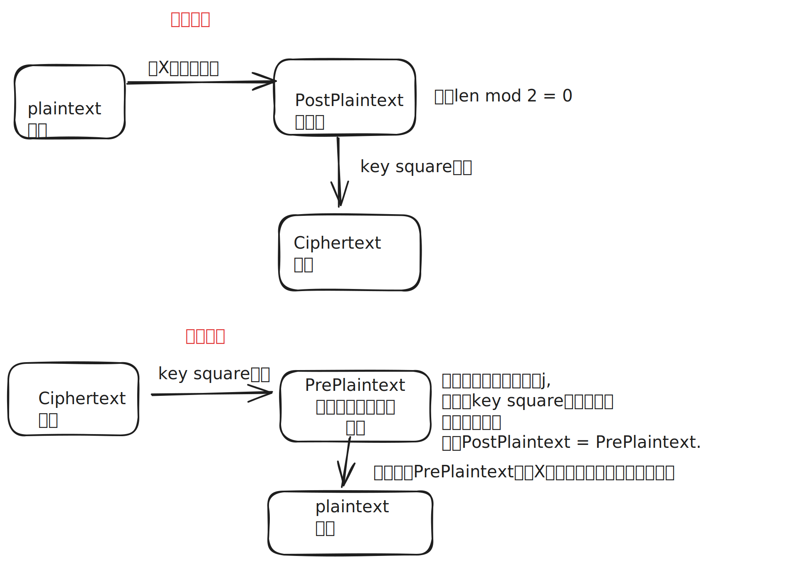

图中所提到的`key square加/解密`很大程度上就是一个对应法则，看二元组的字母的三种存在方式决定如何选择对应的二元组。这是Playfair加密算法的原理。

注意到`verify.py          验证解密明文，确保明文中包含分割重复字符添加的 'X'`

所以实际上在这个程序中我们得到PrePlaintext即可。不需要去除X字母。

但是由于i和j被视作了同一个字母，我们需要对每个i进行枚举看看是不是j吗， 答案是不需要， 因为初始代码中有注释：**NEITHER THE CIPHER OR THE KEY SHOULD HAVE THE LETTER 'J' IN IT. IT WILL CRASH IF YOU DO NOT DO THESE THINGS. THIS IS A PROOF OF CONCEPT ONLY.** 也就是说我们相当于认为j不存在了，这进一步简化了我们的操作难度。

总体而言，我们只需要根据`key square`， 算好座标对应关系， 然后根据算法加密的一一映射关系，逆推出对应的次明文二元字母对， 很快能得到次明文， 我们所需要的就是次明文。

### 5.1.2 具体实现

按照课本的意思，我们是有一个$5\times5 $大小的秘钥矩阵(j暂且被认为和i是同一个字母，j不再出现)。为了索引，我写了一个简单的把二维坐标映射到一维索引的辅助函数.

注意到我们如果需要进行key square的逆映射，知道字母的二维坐标很重要，方便知道对应二元字母组。所以还需要2个辅助函数把索引转化为横坐标和纵坐标。

```c
inline int indexKeySquare(int row, int col) {
    assert(row <= 4 && row >= 0 && col <= 4 && col >= 0);//防御性编程
    return row * WIDTH + col;
}

inline int rowFromIndex(int index) {
    assert(index <= 24 && index >= 0);
    return index / WIDTH;
}

inline int colFromIndex(int index) {
    assert(index <= 24 && index >= 0);
    return index % WIDTH;
}
```

同时因为这些信息最开始没有给出，我们要遍历key字符数组来得到这些信息，存起来。这和`scoreTextQgram.c`当中的把四元组坐标映射到一维索引是一样的。

```c
score += qgram[17576*temp[0] + 676*temp[1] + 26*temp[2] + temp[3]];
```

首先认为j不存在，将每个字母映射为从0到24的数字，然后用两个数组记录他们在矩阵中的座标。

```c
static int letterToKeyIndex(char letter){
    assert(letter >= 'A' && letter <= 'Z' && letter != 'J');
    if (letter > 'J') {
        return letter - 'A' - 1;//看成j不存在，所以j后面的字母的序号前移1位
    }
    return letter - 'A';
}
for (index = 0; index < 25; index++) {
    int letterIndex = letterToKeyIndex(key[index]);//letterIndex可以看成字母本身
    rowPos[letterIndex] = rowFromIndex(index);
    colPos[letterIndex] = colFromIndex(index);
}
```

之后通过分类讨论三种情况来得到对应的次明文中的两个字母是多少，存到result中去，这里的left, right是指在文本中的左右邻接的二元组的相对顺序：

```c
if (leftRow == rightRow) {
    leftCol = (leftCol + WIDTH - 1) % WIDTH;
    rightCol = (rightCol + WIDTH - 1) % WIDTH;
} else if (leftCol == rightCol) {
    leftRow = (leftRow + WIDTH - 1) % WIDTH;
    rightRow = (rightRow + WIDTH - 1) % WIDTH;
} else {
    int tempCol = leftCol;
    leftCol = rightCol;
    rightCol = tempCol;
}
result[i] = key[indexKeySquare(leftRow, leftCol)];
result[i + 1] = key[indexKeySquare(rightRow, rightCol)];
```

循环头是这么写的:*for* (i *=* *0*; i *<* *len*; i *+=* *2*)

最后将result的末尾添加空字符，返回即可。

### 5.2 playfairCrack 实现

关于模拟退火，我参考了`lab1-1实验指导书`以及一本有关元启发式算法当中的一些讲解，深入理解了退火过程的物理模拟性和概率上的Metropolis法则的应用。

书中给出了如图的伪代码说明，我感觉是比较清晰的。

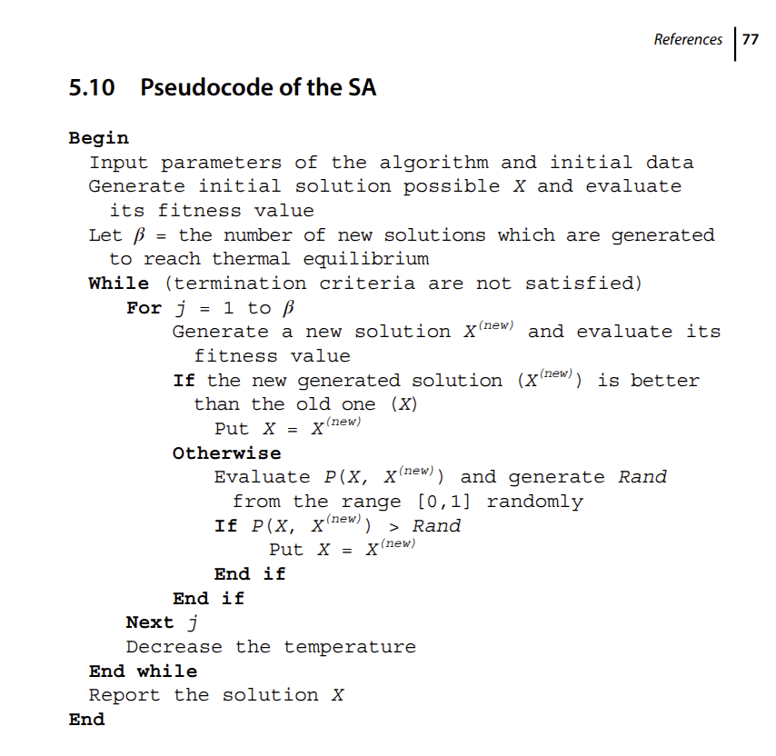

在这里我们的fitness function实际上就是对四元组出现概率取对数之后求和的结果，这就是`scoreText.c`的逻辑， 实际上`qgr.h`存的就是概率取对数后的负数值。（对概率取对数在深度学习算法中也很常见）

我们的目的是使得fitness function值最大，也就是比较score最大即可， 别看是负数，因为log本身是单调递增的，所以我们还是需要score最大才能让概率最大。

算法的**关键**部分就是如下的循环，这里我们的温度变化直接用了线性递减策略，验证下来是比较好的。

```c
   for (temperature = TEMP; temperature > 0.0; temperature -= STEP) {//线性降温
       for (count = 0; count < COUNT; count++) {
           double deltaFitness;
           double acceptanceThreshold;
           double randomValue;
           modifyKey(childKey, parentKey);
           playfairDecipher(childKey, text, childPlain, len);
           childScore = scoreTextQgram(childPlain, len);
           deltaFitness = childScore - parentScore;
           if (deltaFitness > 0.0) {
               strcpy(parentKey, childKey);
               parentScore = childScore;
           } else {
               acceptanceThreshold = exp(deltaFitness / temperature);
               randomValue = (double) rand() / ((double) RAND_MAX + 1.0);//得到0，1之间的随机数
               if (randomValue < acceptanceThreshold) {
                   strcpy(parentKey, childKey);
                   parentScore = childScore;
               }
           }
           if (parentScore > bestScore) {
               bestScore = parentScore;
               strcpy(bestLocalKey, parentKey);
           }
       }
   }
```

实践当中也有别的降温策略，比如指数降温，慢降温等等。

## 6 实验结果

> 通过复制或截图的方式记录实验执行的结果。

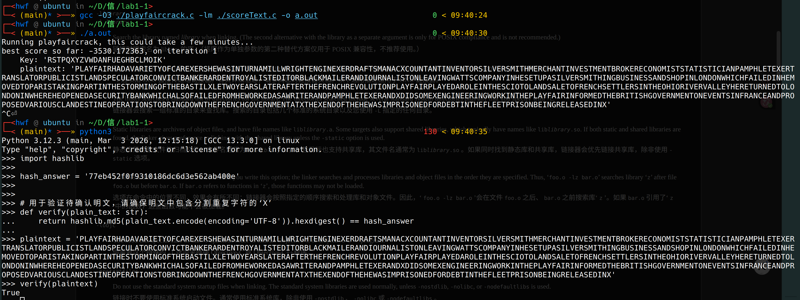

我的SA算法在第一个iteration中就直接给出了正确的次明文， 通过`REPL`python编程确认了这是对的。

注意到SA算法在第一个iteration之后一直在死循环，找不到更好的答案了，所以我直接把第一轮的最优解验证了，发现第一轮就能找到全局最优解。

## 7 扩展实验（选做）

> 使用暴力穷举 / 双字母词频分析法破译 Playfair 密码，不使用模拟退火。

### 7.0 手写思路（原文恢复）

我们可以先通过互联网得到二元组的出现频率数组（也取对数），视作概率。

比如网站https://norvig.com/mayzner.html 提到了2元字母对的频率。

不过为了简便，可以使用本地提供的语料来直接生成自己的频率。 这里我选择的是网站，因为语料库基本都要付费购买，如果是随便使用几个英语文本的话又不太够。

爬取html代码（网站没有方便的下载统计的方式）

保存为`2.html` 用python脚本处理一下即可。

有关明文的双字母出现频率我们已经知道了。 接下来是统计密文双字母频率，实验指导中说需要大量的密文，这个原因是很显然的，只有密文充分多，我们才能得出有意义的频率（趋近语料库的频率）

那么我们拿什么来作为明文呢？

我突然想到，因为我们的playfair算法有两个很难处理的点，一个是I/J看作一个字母， 另一个是X填充的问题。如果我们贸然使用网上下载的正常明文的双字母词频作为标准的话，我们是无法顺利逆解密的。

我们对标的应当是次明文，也就是被X填充后的明文。

所以为了**简化实验**， 我使用一些英语片段，并且用他们的填充后的次明文作为统计对象。

然后从这些片段中选一个把填充后的次明文加密，之后作为密文，来进行解密。

这样就解决了X的问题，至于I/J的问题， 我决定在得到次明文的同时将所有J转成I. 一律认为所有的J是I.

为了思路清晰，见如下图：

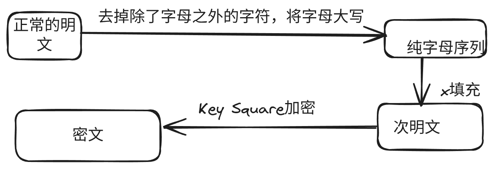

我们这里把次明文作为明文，目的是从密文解密到次明文， 所以统计频率也是统计次明文的频率。

下面是具体说明，之所以称这是暴力枚举，就是枚举所有的密钥可能性，然后对每个密钥根据双字母频率进行打分， 得到最优解。


### 7.1 代码实现与结果（追加）

### 7.1.1 方法设计

本部分实现文件为 `playfair_freqcrack.c`，使用**纯穷举 + 双字母词频打分**，不使用模拟退火。

1. 从 `corp.txt` 读取语料，保留字母、转大写、将 `J` 统一映射为 `I`。
2. 对训练语料构造 Playfair 次明文（重复字母插入 `X`，末尾补 `X`），统计双字母分布，得到语言模型。
3. 对密文统计双字母分布，按频率排序，与明文双字母排序做 rank 对应，得到双字母替代表（用于分析展示）。
4. 暴力穷举密钥家族：
     - 以关键字密钥为基准（本实验取 `PLAYFAIR` 生成基准方阵）；
     - 穷举 `5!` 行排列、`5!` 列排列、行翻转、列翻转、转置；
     - 总搜索空间：`5! * 5! * 2 * 2 * 2 = 115200`。
5. 对每个候选密钥解密密文，计算“解密文本双字母分布”在语言模型下的对数似然（越大越好），取全局最优。

#### 7.1.1.1 为什么这样设计

这部分采用“受约束的全枚举”，核心原因是：

1. 若对 Playfair 全空间暴力，密钥数是 `25! ≈ 1.55 × 10^25`，在课程实验条件下不可计算。
2. 若按每秒评估 `10^6` 个密钥估算，完整遍历也需要约 `4.9 × 10^11` 年，远超可接受时间。
3. 因此需要在“仍然是暴力穷举”的前提下，引入可解释的结构约束：只枚举基准方阵的行/列排列、翻转与转置变换，得到 115200 个候选，能在本机快速完成。
4. 该设计保持了暴力法的确定性（无随机扰动、无退火概率），便于复现实验与分析停机。
5. 评分函数仍然是双字母词频模型，符合本题“词频分析法”要求。
6. 程序中增加了两组并行场景（Case A / Case B）：
    - Case A 用于展示“等价密钥”现象：密钥字符串可能不一致，但明文可 100% 恢复；
    - Case B 用于展示“可恢复为完全相同字符串密钥”的情况。
    这样可以更完整解释为什么只看 `key_equal` 不够，必须结合解密准确率判断破解是否成功。

### 7.1.2 停机条件

因为是穷举法，停机条件是**搜索空间枚举完毕**。本实现中固定为 115200 个候选密钥全部评估后停止。

补充说明：该停机规则是确定性的，不依赖迭代温度、随机种子或启发式收敛判据，因而便于对比不同密文长度下的行为。

### 7.1.3 密文长度与语料是否足够，也即探索问题

`corp.txt` 的统计如下（命令：`wc -c corp.txt && wc -w corp.txt && tr -cd 'A-Za-z' < corp.txt | wc -c`）：

- 字节数：6977
- 词数：1031
- 纯字母数：5762

程序将其按 7:3 分为训练与攻击数据：

- 训练：4033 字母，次明文长度 4094
- 攻击：1729 字母，次明文长度 1752

在本实验设定下，语料长度足够。密文长度敏感性测试（步长 100）显示：从 **300** 开始就可达到 100% 次明文恢复准确率，因此建议本配置下次明文长度至少约 **300**。

### 7.1.4 编译运行与结果

编译运行命令：

```bash
gcc -O3 playfair_freqcrack.c -lm -o playfair_freqcrack
./playfair_freqcrack > playfair_freq_output.txt
```

关键输出摘录：

```text
[Single Attack Demo]
    ciphertext length    : 1752
    tested keys          : 115200
    recovered key        : PNIEUAQBHWYSCKXLORGVFTDMZ
    key string equal     : NO (Playfair has equivalent keys)
    plaintext accuracy   : 100.00%

[Ciphertext Length Sensitivity]
    stopping rule: first length with plaintext accuracy >= 99.9%.
    len= 300 => acc=100.00%
    ...
    => Recommended minimum secondary-plaintext length: 300
```

说明：`recovered key` 与 `secret key` 字符串不完全一致，但解密得到的次明文完全一致（100%），这是 Playfair 存在等价密钥表示导致的现象。有时候会得到等价密钥，有时候不会。

截图：

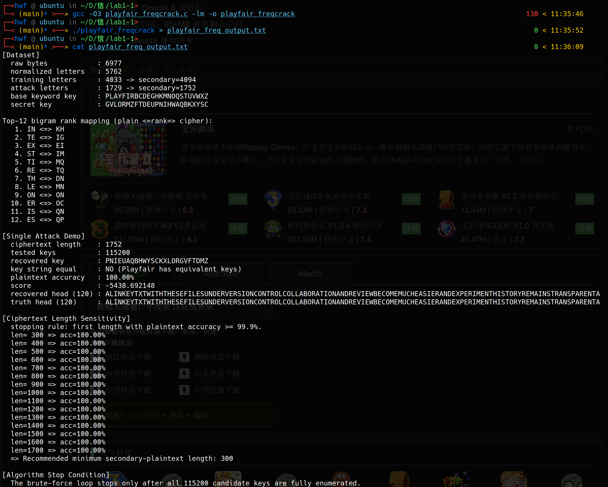

可以看到第一个demo中恢复的密钥并不等于真正的密钥，但是解密是成功的，这说明特定条件下密钥的等价性。**因为我们搜索的方向是一定的，所以每次都会先搜索到这个等价实现。**如下[问答网站](https://crypto.stackexchange.com/questions/3783/how-many-keys-does-the-playfair-cipher-have)说明了，并不是25!个密钥，有些是等价的。

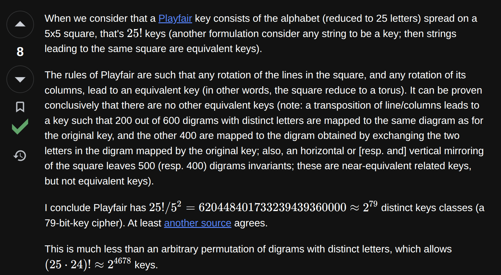

我补充了一下代码逻辑，确定了上面两个密钥是等价实现：

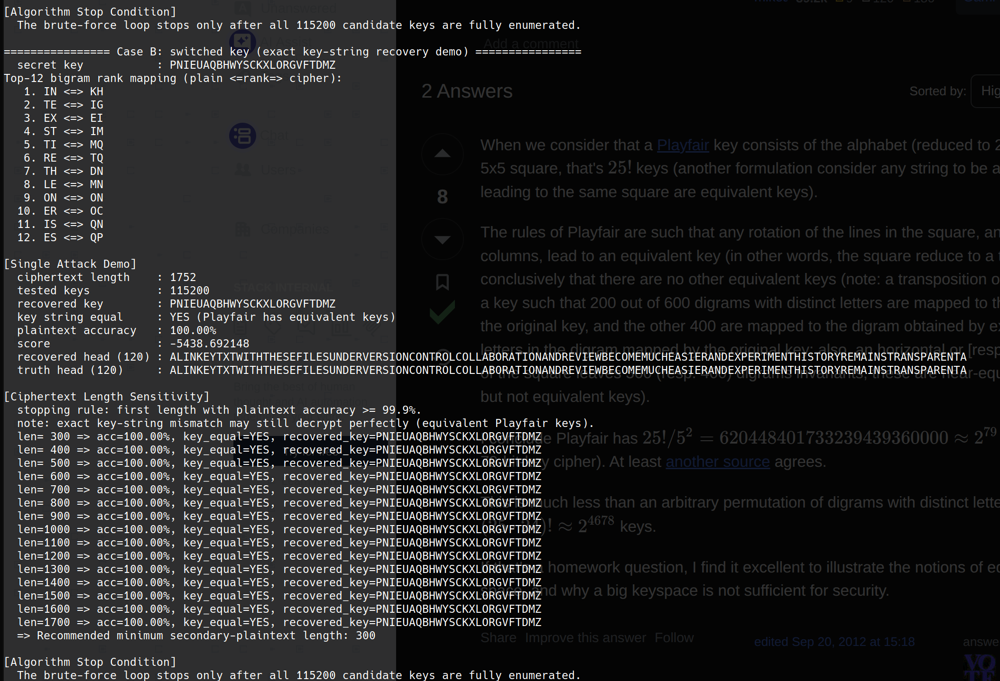

## 8 实验总结

> 选填。可以记录调试过程中出现的问题及解决方法、对实验结果的分析、对实验的改进意见等。

### 8.1 问题和解决方法

首先说说碰到的问题，第一个是我在linux平台上发现`lab1-1实验指导书`给出的编译指令中选项顺序是错误的：

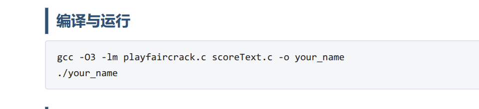

根据gcc官方说明(https://gcc.gnu.org/onlinedocs/gcc/Link-Options.html)，-lm链接参数需要放到用了库m(也就是math库)的源文件后面，所以我编译出了如下错误，如果把-lm放到用了math库的.c文件后面就可以了。

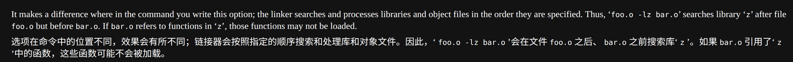

下面是我的编译运行截图：

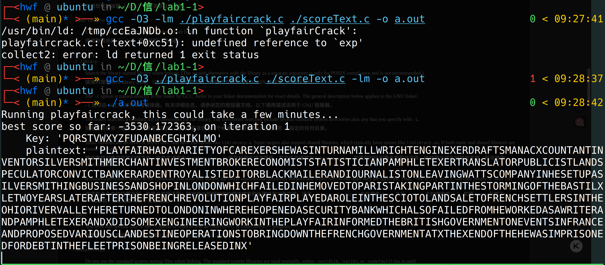

因为是`playfaircrack.c`用了math库(libm.a)，所以把-lm放在它后面即可，如下也是对的：

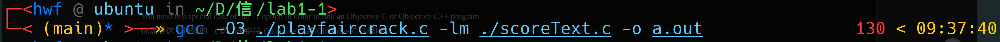

第二个问题就是Playfair原来是存在等价密钥的，我一开始只是认为有25!个可能，没想到有等价密钥，所以搜索结果可能会和定义的密钥不同。https://crypto.stackexchange.com/questions/3783/how-many-keys-does-the-playfair-cipher-have 反过来说，也可以利用这个性质减小搜索时间。

还有一个问题也是一开始没想清楚， 我发现解密出来的答案有连续相同的字母，但是verify通过了，我感到迷惑，但仔细想了之后，发现所谓X的填充，只有在从左到右枚举2字母元组的时候发现是相同的才会填充。

而像`AVALLEY`这样的明文（这里不计空格，原来的正常写法是 a valley, 一个山谷），被分组的时候连续的两个L并不会分到同一组， 所以不会填充X, 解密的时候这两个L也不会在一组，不会引发问题。

---

## 自查清单

提交前请逐项确认，完成的项目在「完成情况」列填写 **done**。

| # | 检查项 | 完成情况 |
|---|--------|----------|
| 1 | `playfairDecipher` 函数已补全 | done |
| 2 | `playfairCrack` 函数已补全 | done |
| 3 | 源代码可编译运行（`gcc -O3 -lm playfaircrack.c scoreText.c -o your_name`） | done(前面已经指出，实际上-lm选项位置错了，应该在playfaircrack.c之后) |
| 4 | 程序运行结果正确（输出可辨认的英文明文） | done |
| 5 | 使用 `verify.py` 验证通过 | done |
| 6 | 实验思路阐述清晰（第 5 节） | done |
| 7 | 实验结果已记录（第 6 节） | done |
| 8 | 扩展实验（选做，第 7 节） | done |
| 9 | 提交文件结构正确（见实验指导书） | done |
