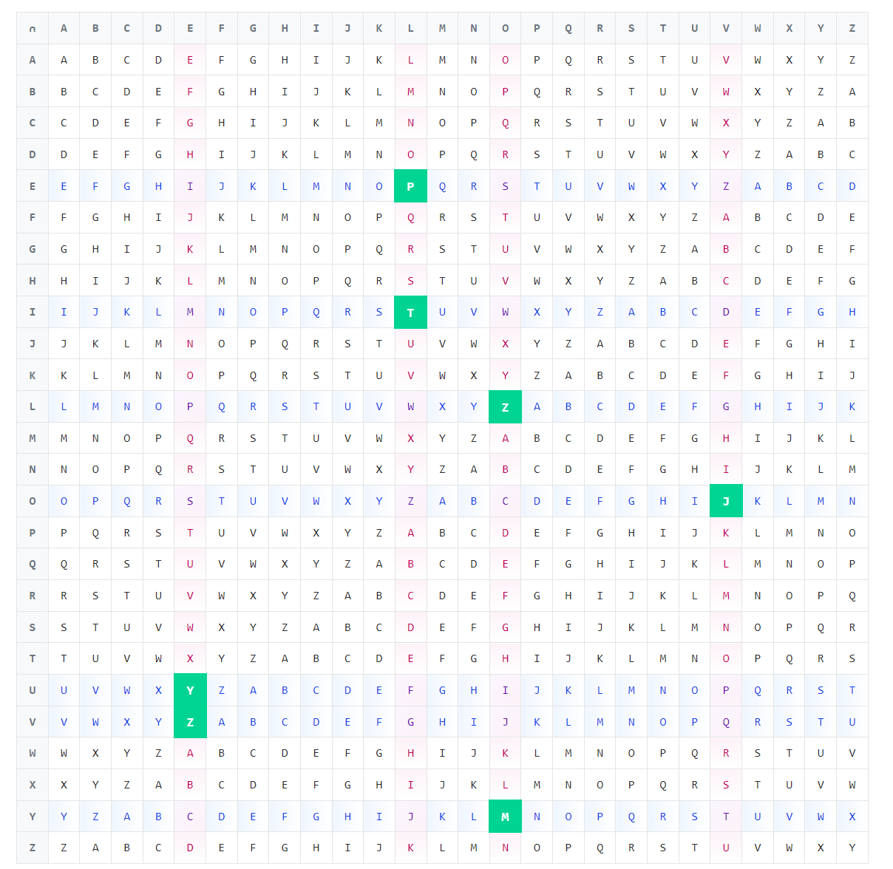
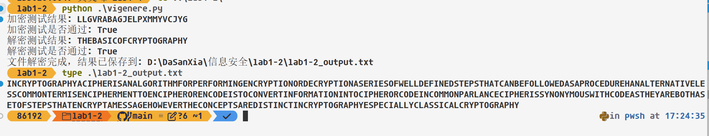

# 《信息安全》实验报告

| 项目 | 内容 |
|------|------|
| 实验名称 | Vigenere 密码的加密与解密 |
| 姓名 | 黄文峰 |
| 学号 | 23302010049 |
| 日期 | 2026/3/17 |

---

## 1 实验目的

- 了解古典密码中的加密和解密运算
- 了解古典密码体制
- 掌握古典密码的统计分析方法

## 2 实验原理

Vigenere 密码是一种多字母表替换密码。使用一个关键词循环重复构建与明文等长的密钥[^1]，然后逐字母进行移位加密：

- 加密：C ≡ M + K (mod 26)
- 解密：M ≡ C − K (mod 26)

> **TODO**: 根据自己的理解，补充 Vigenere 密码的原理细节（如字母表对照、密钥构建过程等）。

Vigenere加密实际上就是单表替换凯撒加密的进阶， 因为秘钥长度往往比较短，实际上的效果就是每隔len(key)个字母的密文字母使用的是同一个替换表，也就是这些字母的移位量是相同的。

凯撒加密的秘钥是一个1~25[^2]的数字(0认为是没有加密)，而Vigenere加密的秘钥则是一串字母序列，等价于一串数字（移位量）且每个数字介于0~25（将字母和数字依次映射， A->0, B->1，以此类推）.

[^2]: 我们默认使用大写字母， 并且不考虑空格等其他字符

### 2.1 从秘钥字符串得到秘钥数字串

假设秘钥是: 'DECLARATION'

那么对应的移位量序列如下：


对应的转化算法如下python函数所示，可以得到一串数字，方便后续处理。

```python
def key_vigenere(key):
    keyArray = []
    for i in range(0,len(key)):
        keyElement = ord(key[i]) - 65 #A的ascii值为65
        keyArray.append(keyElement)
    return keyArray

secretKey = 'DECLARATION'
key = key_vigenere(secretKey)
print(key)
```

### 2.2 利用秘钥数字序列进行循环移位加密

[^1]: 文档最开始说的想法也有道理，可以先把秘钥序列循环到刚好不小于密文的长度，然后尾截断到和密文一样长得到等长秘钥，之后可以直接加密。这和循环遍历秘钥序列是一样的效果，下面我实现后者(因为python有itertools下的cycle接口产生无限循环的迭代器，可以直接用这个)。

```python
from itertools import cycle
def shiftEnc(c, offset):#根据位移量，向后位移offset得到新字母
    return chr((ord(c) - ord('A') + offset) % 26 + ord('A'))

def enc_vigenere(plaintext, key):
    secret = ''.join(shiftEnc(p, k) for p, k in zip(plaintext, cycle(key)))
    return secret

secretKey = 'DECLARATION'
key = key_vigenere(secretKey)
plaintext = 'WEAREFAMILY'
ciphertext = enc_vigenere(plaintext, key)
print(ciphertext)
```

### 2.3 理解“字母表对照”

理解这个算法的关键就在于循环加密的理解，有一个周期性（周期为len(key)）。

介绍Vigenere加密的时候往往会给出一个很大的字母表格，这个表格实际上就是循环加密的一种具象化，如下图(在线网站[Vigenere Cipher Table - Tabula Recta Tool](https://caesarcipher.org/ciphers/vigenere/table)提供了这个表格，在这里我表示衷心感谢)。

我将'ILOVEYOU'用秘钥'LOVE'加密。对表格的解释如下：



首先把每一行开头的字母看做明文中出现的字母，每一列开头的字母看做对应的秘钥字母（循环迭代对应或者循环拼接成等长秘钥后，秘钥当中的字母按位次和明文字母一一对应）。

我们把秘钥循环并截短到等长秘钥: LOVELOVE(明文有8个字母)

那么明文和秘钥字母的对应加密关系为（下图的加法省略了转成从0到25的整数和对26取模的部分）:


体现在表格当中就是，我们想知道I被L加密成为什么了的时候，找到行首为I的行和列首位L的列，他们的交点（共同元素）就是密文字母——也就是表格中高亮成绿色的字母T。其他字母以此类推，当前4个字母ILOV被推理玩的时候，发现LOVE也正好迭代完了一次，于是开始循环迭代，EYOU对应第二次迭代的LOVE。

具体的加/解密代码实现在后文部分给出。

## 3 实验环境

- 操作系统：Windows 11
- 编程语言：Python3.12

## 4 实验内容

1. 给定密钥，实现 Vigenere 密码的加密和解密算法
   - 加密测试：明文 `THEBASICOFCRYPTOGRAPHY`，密钥 `SECURITY` → 密文 `LLGVRABAGJELPXMMYVCJYG`
   - 解密测试：密文 `YBHBNXCFOSHLBPGTAUACMS`，密钥 `FUDAN` → 明文 `THEBASICOFCRYPTOGRAPHY`
2. 使用密钥 `CRYPTOGRAPHY` 解密 `lab1-2_input.txt`，将结果保存为 `lab1-2_output.txt`
3. 将解密结果中包含的信息写入实验报告
4. 完成实验报告

## 5 实验思路

> 结合代码说明算法设计思想与实现步骤。

### 5.1 加密算法实现

这部分的原理在第2部分已经说过，选择python作为实现语言是因为python支持多种编程模式，而且生态丰富，学界常用这门语言，另外他的迭代器也很丰富，写法比较简洁明了。

这里给出python代码：

```python
def shiftEnc(c, offset):#根据位移量，向后位移offset得到新字母
    return chr((ord(c) - ord('A') + offset) % 26 + ord('A'))

def enc_vigenere(plaintext, key):
    secret = ''.join(shiftEnc(p, k) for p, k in zip(plaintext, cycle(key)))
    return secret
```

主要用到了chr()和ord()来实现ascii码和字符的转化，进一步实现数字计算。

同时python的迭代特性也使得代码比较简洁。

### 5.2 解密算法实现

```python
def shiftDec(c, offset):#根据位移量，向前位移offset得到原字母
    return chr((ord(c) - ord('A') + 26 - offset) % 26 + ord('A')) #加26是为了避免负数取余，尽管这里如果c是大写字母的话不可能出现这种情况

def dec_vigenere(ciphertext, key):
    plain = ''.join(shiftDec(c, k) for c, k in zip(ciphertext, cycle(key)))
    return plain

```

基本上是和加密算法对称的写法，只是位移要还原回去的话是反向位移，也就是减去秘钥字母并取余。 其余写法和加密算法大差不差。

调用这些算法进行操作的部分写在main函数中,为了方便没有写成接受命令行参数的可拓展模式，而是硬编码了要求中的测试用例，如下：

```python
def main():
    # 加密测试
    plaintext_test = "THEBASICOFCRYPTOGRAPHY"
    key_encrypt = "SECURITY"
    expected_ciphertext = "LLGVRABAGJELPXMMYVCJYG"
    encrypted = enc_vigenere(plaintext_test, key_vigenere(key_encrypt))
    print("加密测试结果:", encrypted)
    print("加密测试是否通过:", encrypted == expected_ciphertext)

    # 解密测试
    ciphertext_test = "YBHBNXCFOSHLBPGTAUACMS"
    key_decrypt = "FUDAN"
    expected_plaintext = "THEBASICOFCRYPTOGRAPHY"
    decrypted = dec_vigenere(ciphertext_test, key_vigenere(key_decrypt))
    print("解密测试结果:", decrypted)
    print("解密测试是否通过:", decrypted == expected_plaintext)

    # 文件解密：只处理字母字符，避免换行或空格影响计算
    input_path = os.path.join(os.path.dirname(__file__), "lab1-2_input.txt")
    output_path = os.path.join(os.path.dirname(__file__), "lab1-2_output.txt")
    file_key = key_vigenere("CRYPTOGRAPHY")

    with open(input_path, "r", encoding="utf-8") as file:
        ciphertext = file.read()

    ciphertext = ''.join(c for c in ciphertext.upper() if 'A' <= c <= 'Z')
    plaintext = dec_vigenere(ciphertext, file_key)

    with open(output_path, "w", encoding="utf-8") as file:
        file.write(plaintext)

    print("文件解密完成，结果已保存到:", output_path)
```

## 6 实验结果

> 通过复制或截图的方式记录实验执行的结果。



这是具体的lab1-2_output.txt内容：

> INCRYPTOGRAPHYACIPHERISANALGORITHMFORPERFORMINGENCRYPTIONORDECRYPTIONASERIESOFWELLDEFINEDSTEPSTHATCANBEFOLLOWEDASAPROCEDUREHANALTERNATIVELESSCOMMONTERMISENCIPHERMENTTOENCIPHERORENCODEISTOCONVERTINFORMATIONINTOCIPHERORCODEINCOMMONPARLANCECIPHERISSYNONYMOUSWITHCODEASTHEYAREBOTHASETOFSTEPSTHATENCRYPTAMESSAGEHOWEVERTHECONCEPTSAREDISTINCTINCRYPTOGRAPHYESPECIALLYCLASSICALCRYPTOGRAPHY

由于去掉了空格，可读性不是很高，不过还是很明显可以看出来这段话加上空格应该是:

> IN CRYPTOGRAPHY A CIPHER IS AN ALGORITHM FOR PERFORMING ENCRYPTION OR DECRYPTION A SERIES OF WELL DEFINED STEPS THAT CAN BE FOLLOWED AS A PROCEDURE H AN ALTERNATIVE LESS COMMON TERM IS ENCIPHERMENT TO ENCIPHER OR ENCODE IS TO CONVERT INFORMATION INTO CIPHER OR CODE IN COMMON PARLANCE CIPHER IS SYNONYMOUS WITH CODE AS THEY ARE BOTH A SET OF STEPS THAT ENCRYPT A MESSAGE HOWEVER THE CONCEPTS ARE DISTINCT IN CRYPTOGRAPHY ESPECIALLY CLASSICAL CRYPTOGRAPHY

## 7 扩展实验（选做，不计分）

> 破解 Vigenere 密码：利用 Kasiski 测试或 Friedman 测试推断密钥长度，再通过字母频率分析推断密钥。

<!-- TODO: 如完成扩展实验，在此描述思路、实现与结果 -->

## 8 实验总结

> 选填。可以记录调试过程中出现的问题及解决方法、对实验结果的分析、对实验的改进意见等。

<!-- TODO: 填写实验总结 -->

---

## 自查清单

提交前请逐项确认，完成的项目在「完成情况」列填写 **done**。

| # | 检查项 | 完成情况 |
|---|--------|----------|
| 1 | Vigenere 加密算法已实现 | |
| 2 | Vigenere 解密算法已实现 | |
| 3 | 加密测试用例通过（THEBASICOFCRYPTOGRAPHY + SECURITY → LLGVRABAGJELPXMMYVCJYG） | |
| 4 | 解密测试用例通过（YBHBNXCFOSHLBPGTAUACMS + FUDAN → THEBASICOFCRYPTOGRAPHY） | |
| 5 | 源代码可编译/运行 | |
| 6 | `lab1-2_input.txt` 已解密并保存为 `lab1-2_output.txt` | |
| 7 | 解密结果中的信息已写入报告（第 6 节） | |
| 8 | 实验思路阐述清晰（第 5 节） | |
| 9 | 扩展实验（选做，不计分，第 7 节） | |
| 10 | 提交文件结构正确（见实验指导书） | |
